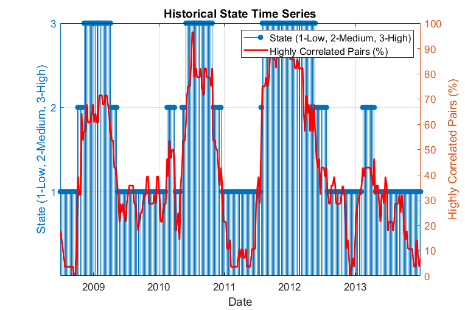

# Exploring Risk Contagion Using Graph Theory and Markov Chains

Recent financial crises and periods of market volatility have heightened awareness of risk contagion and systemic risk among financial analysts. As a result, financial professionals are often tasked with constructing and analyzing models that will yield insight into the potential impact of risk on investments, portfolios, and business operations.

Several authors have described the use of advanced mathematical and statistical techniques for quantifying the dependent relationships between investments, foreign exchange rates, industrial sectors, or geographical regions. Bridging the gap between formal methods and a working code implementation is a key challenge for analysts.

This code, along with the corresponding [technical article](https://uk.mathworks.com/company/newsletters/articles/exploring-risk-contagion-using-graph-theory-and-markov-chains.html) shows how MATLAB&reg; can be used to analyze aspects of risk contagion using various mathematical tools. Topics covered include:

* Data aggregation, preprocessing, and risk benchmarking
* Quantifying dependent relationships between financial variables
* Visualizing the resulting network of dependencies together with proximity information
* Analyzing periods of risk contagion using hidden Markov models

## Installation and Getting Started
The examples are provided as a [MATLAB toolbox](https://www.mathworks.com/help/matlab/matlab_prog/create-and-share-custom-matlab-toolboxes.html).
1. Download the toolbox installer (the `Risk_Contagion.mltbx` file) from the `Releases` section on GitHub.
2. Double-click on `Risk_Contagion.mltbx` file to install the toolbox.
3. Open the main example script: `>> edit RiskContagion`

### [MathWorks&reg;](https://www.mathworks.com) Product Requirements

This example requires MATLAB R2025a or a later release.
- [MATLAB&reg;](https://www.mathworks.com/products/matlab.html)
- [Statistics and Machine Learning Toolbox&trade;](https://www.mathworks.com/products/statistics.html)
- [Parallel Computing Toolbox&trade;](https://www.mathworks.com/products/parallel-computing.html) (Optional)

## License
The license for this entry is available in the [license.txt](license.txt) file in this GitHub repository.

Copyright 2016-2026 The MathWorks, Inc.

## Community Support
[MATLAB Central](https://www.mathworks.com/matlabcentral)
